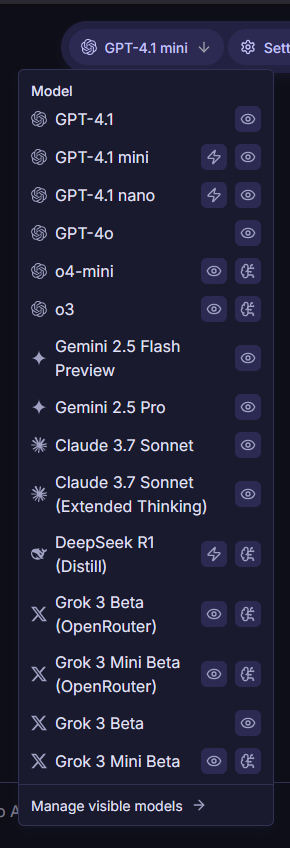

Introducing new features, bug fixes, and improvements in version 3.0.

TLDR; Enhanced Canvas feature, improved message controls, internal changes, and bug fixes.

<!--truncate-->

## Deni AI Canvas

Added a feature called Canvas, allowing AI to create Markdown documents. You can also edit the content of the Canvas yourself.

_Canvas Preview_

## New Models

New models such as o3, o4-mini, GPT-4.1 series, Grok 3 (OpenRouter/xAI), and DeepSeek R1 (Distill) have been added. Additionally, stability has been further increased by temporarily changing the provider to the official one.

_New Models_

## Improved Message Controls

Improvements have been made, such as adding model selection to regeneration.

## Feature Changes

This version includes 5 feature changes:

- App: Added "Canvas" feature for AI document creation.
- App: New models (o3, o4-mini, GPT-4.1, GPT-4.1 mini, GPT-4.1 nano, Grok 3 (OR, xAI), DeepSeek R1 Distill)
- App: Enhanced responsive design.
- Message Operations: Added model selection to regeneration.
- Message Operations: Changed the generation time button to a `div`.

## Bug Fixes

The following bugs have been fixed in this version:

- App: Fixed an issue where users were not redirected to the home page after login.

## System Changes

The following system changes have been made in this version:

- Changed package manager to `pnpm` for compatibility.
- Added support for tool streaming.
- Changed the model ID for Claude 3.7 Sonnet.

## Future Plans

- **Deni AI for Development:** Developer features, including development capabilities using WebContainers and the Deni AI CLI, are planned for future updates.
- **Message Log:** The fix for the issue where thinking time shows 0 seconds until the next message is sent has been postponed to a future update as further investigation is required.

For all changes not included in the patch notes, please see the [GitHub Pull requests](https://github.com/raicdev/deni-ai/pull/22).

:::note

The Deni AI repository has moved to https://github.com/raicdev/deni-ai. Future commits will be made to this repository.

:::

:::note

Going forward, old version branches will not be deleted. Please be careful not to refer to the source code of old versions by mistake.

:::
