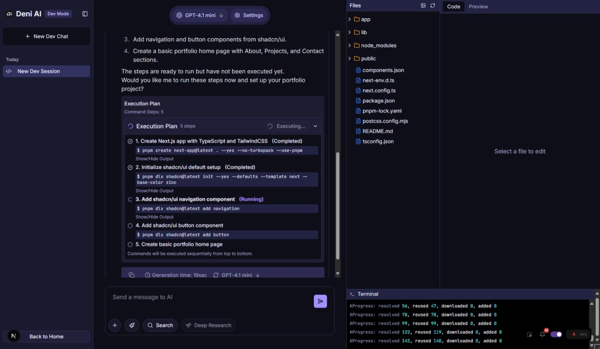

Introducing new features, bug fixes, and improvements in version 3.1.

<!--truncate-->

## Deni AI Dev (Public Preview)

Deni AI Dev is your new development platform. Get ideas, build apps directly. Develop freely.

However, Deni AI Dev is in public preview and early access, so various functional limitations and issues may occur.

### Limitations

- **Development Sessions**: Development sessions are saved locally only and cannot be exported/imported.
- **Terminal Interaction**: You cannot type into the terminal.

_Preview of Deni AI Dev_

## Further Improved Research

Deep Research has been further improved. By summarizing once using GPT-4.1 nano, you can now perform detailed research faster and at a lower cost. Additionally, a new detailed research log has been added. A short summary of the site is listed below the site name.

_The Deni AI team is further enhancing Deep Research. We plan to add features like progress tracking in the future._

_Preview of Further Improved Deep Research_

## Feature Changes

Four feature changes have been added in this version.

- App: Added Deni AI Dev (Public Preview)
- App: Removed the feature to save the current session
- App / Deep Research: Added a panel to display progress
- App / Deep Research: Added functionality to summarize search results using GPT-4.1 nano

## Bug Fixes

One bug was fixed in this version.

- App: Fixed an issue where unnecessary parts of the search box were being re-rendered
- App: Fixed an issue where the thinking time in the message log became 0 seconds

## System Changes

One system change was made in this version.

- Updated dependencies for all projects

## Future Plans

- **Message Log:** The issue where thinking time was displayed as 0 seconds under certain conditions has been fixed.

### Deni AI for Developers

Version 3.2.0 is scheduled for release on May 1st.

- The official release of Deni AI Dev will be in v3.2.0.
- The public preview of Deni AI CLI will be released concurrently with v3.2.0, with the official release planned for v3.3.0.

For all changes not included in the patch notes, please see the [GitHub Pull requests](https://github.com/raicdev/deni-ai/pull/32).

:::note

The Deni AI repository has moved to https://github.com/raicdev/deni-ai. Future commits will be made to this repository.

:::

:::note

Going forward, branches for older versions will not be deleted. Please be careful not to mistakenly reference the source code of older versions.

:::
