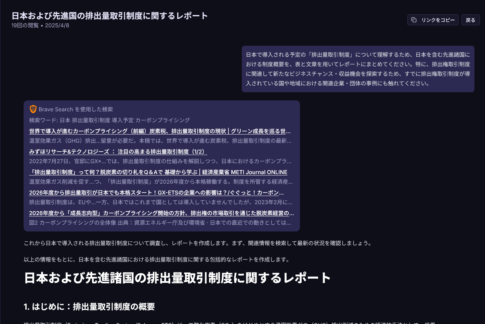

TLDR; 共有、検索、リサーチ

## 改善したリサーチと検索機能

詳細な検索は詳細なリサーチ (Deep Research) に生まれ変わり、より良い結果を得られるようになりました。

また、検索機能はページのすべての内容を送信しなくなりました。これにより、早く結果が得られます。(設定から変更可能)

<small>※すべての内容を送信しない場合、検索機能の精度が下がる可能性があります。</small>

_詳細な検索のプレビュー_

## 会話を共有

あなたのチャットを即座に共有。これでスクリーンショットが不要になります。

 
_会話共有のプレビュー_

## 新しい設定

設定ページはなくなり、設定ダイアログになりました。これで、ブラウザの戻るボタンを使用する必要がなくなります。

 
_設定ダイアログのプレビュー_

## バグ修正

このバージョンでは、1 つのバグを修正しました。

- インスタンス使用時に、ログイン画面にリダイレクトされる可能性がある問題を修正

## 機能の変更

このバージョンでは、5 つの機能変更が行われました。

- 会話を共有する機能を追加
- 検索機能でページのすべての内容を送信しないように変更
- 設定ページを削除
- 設定ダイアログを追加
- 詳細なリサーチを Deep Research に名称変更

## システムの変更

このバージョンでは、1 つのシステム変更が行われました。

- search ツールと visit ツールを統合

> [!NOTE]
> Deni AI のレポジトリは、https://github.com/raicdev/deni-ai に移動しました。今後はこちらのレポジトリでコミットされます。
