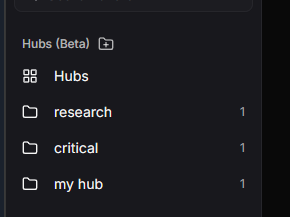

これは、最も大きい Deni AI のリリースです。

## Deni AI ブランチ (Deni AI Branches)

Deni AI Branches は、会話を複数に分けて、それぞれの会話を独立して進めることができる機能です。

ブランチ作成時の会話の内容を引き継ぎ、ブランチを作成することができます。

ブランチを作成することで、会話の内容を分けて進めることができるため、複数のプロジェクトを同時に進めることができます。

_Deni AI Branches のプレビュー_

## Deni AI ハブ (Deni AI Hub)

Deni AI Hub は、会話を仕分けることができる機能です。

近日中に、カスタム指示やファイルの添付、ハブの要約機能が追加される予定です。

_Deni AI Hub のプレビュー_

## Deni AI Bots

Deni AI Bots は、特定の役割に特化した AI を作成することができる機能です。

システムプロンプトを指定でき、すべてのユーザーへ公開されます。(今後プライバシー設定を追加予定)

## 機能の変更

このバージョンでは、13 つの機能変更が追加されました。

- Deni AI Hubs: 会話を仕分ける機能を追加
- Deni AI Branches: 会話を複数に分ける機能を追加
- Deni AI Bots: 特定の役割に特化した AI を作成する機能を追加
- セッション: 開発セッションをエクスポート/インポートする機能を追加
- セッション: すべての開発セッションを削除する機能を追加
- アプリ: Vercel Analytics を切り替えれるように変更
- アプリ: ホームページをより詳しい情報に更新
- アプリ: フッターを更新し、さらに詳しい情報を追加
- アプリ: ヘッターのデザインを変更し、ドロップダウンメニューを追加
- アプリ: ヘッダーに言語変更機能を追加
- アプリ: 機能をカスタマイズできるように変更
- アプリ: アカウントマネージャーにロード状態を追加
- アプリ: アカウントマネージャーのドロップダウンメニューを簡略化

## バグの修正

- アプリ: モデルページにロード状態を追加 (固まる問題を修正)

## システムの変更

このバージョンでは、2 つのシステム変更が行われました。

- すべてのプロジェクトの依存関係を更新
- ドキュメンテーションを Docusaurus から VitePress に移行

## 今後の予定

- **Deni AI CLI**: 開発は一時的に破棄しました。
- **Intellipulse** NEW: Deni AI が搭載されたAI エディタです。 
- **Deni AI API**: Deni AI の近日登場する API プラットフォームです。[詳細](/ja/blog/posts/deni-ai-api-preview)

パッチノートに含まれていないすべての変更点は、[GitHub の Pull requests](https://github.com/raicdev/deni-ai/pull/39) をご覧ください。

> [!NOTE]
> Deni AI のレポジトリは、https://github.com/raicdev/deni-ai に移動しました。今後はこちらのレポジトリでコミットされます。

> [!NOTE]
> デフォルトブランチが``canary``に変更されました。リリース版については``master``ブランチをご確認してください。
