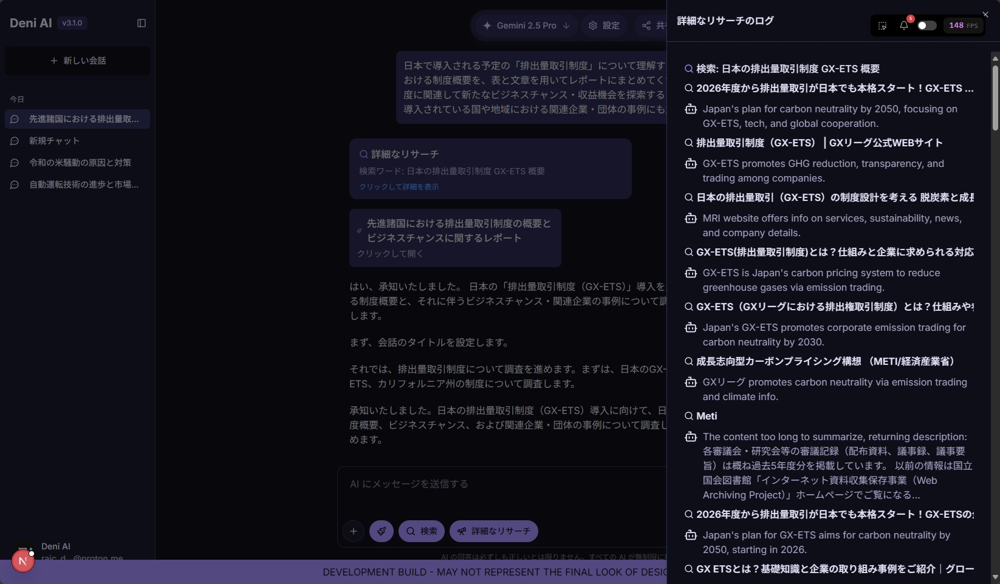

---

title: Deni AI v3.1 のリリース
date: 2025-04-27
description: バージョン 3.1 の新しい機能やバグ修正、改善点をご紹介します。
author: rai
tags: [update]
---

バージョン 3.1 の新しい機能やバグ修正、改善点をご紹介します。

<!-- more -->

## Deni AI Dev (Public Preview)

Deni AI Dev は、あなたの新しい開発プラットフォームです。アイデアを得たり、そのままアプリを作ったり。あなたの自由に開発できます。

ただし、Deni AI Dev はパブリックプレビューで早期アクセスのため、様々な機能制限や問題が発生する可能性があります。

### 制限

- **開発セッション**: 開発セッションはローカルにのみ保存され、エクスポート/インポートできません。
- **ターミナルへの接触**: あなたがターミナルに入力することはできません。

_Deni AI Dev のプレビュー_

## さらに改善されたリサーチ

詳細なリサーチはさらに改善されました。一度、GPT-4.1 nano を使用して要約することによりより早く、より低いコストで詳細なリサーチができるようになりました。また、新しい詳細なリサーチのログが追加されました。サイトの名前の下にそのサイトの短い要約が記載されています。

_Deni AI チームはさらに Deep Research を強化しています。今後、進行状況を見れる機能等を追加します。_

_さらに改善された Deep Research のプレビュー_

## 機能の変更

このバージョンでは、4 つの機能変更が追加されました。

- アプリ: Deni AI Dev (パブリックプレビュー) を追加
- アプリ: 現在のセッションを保存する機能を削除
- アプリ / Deep Research: 進行状況を表示するパネルを追加
- アプリ / Deep Research: GPT-4.1 nano を使用して検索結果を要約する機能を追加

## バグ修正

このバージョンでは、1 つのバグを修正しました。

- アプリ: 検索ボックスの不必要な部分が再描画される問題を修正
- アプリ: メッセージログの思考時間が0秒になる問題を修正

## システムの変更

このバージョンでは、1 つのシステム変更が行われました。

- すべてのプロジェクトの依存関係を更新

## 今後の予定

- **メッセージログ:** 思考時間が一部の条件で 0 秒と表示される問題は修正しました。

### 開発向け Deni AI

バージョン 3.2.0 は、5/1 に公開する予定です。

- Deni AI Dev の正式リリースは、v3.2.0 で公開されます。
- Deni AI CLI のパブリックプレビューは、v3.2.0 と同時に公開され、正式リリースは、v3.3.0 にリリースする予定です。

パッチノートに含まれていないすべての変更点は、[GitHub の Pull requests](https://github.com/raicdev/deni-ai/pull/32) をご覧ください。

::: info Note

Deni AI のレポジトリは、https://github.com/raicdev/deni-ai に移動しました。今後はこちらのレポジトリでコミットされます。

:::

::: info Note

今後、旧バージョンのブランチは削除されません。間違えて旧バージョンのソースコードを参照しないよう、注意してください。

:::
